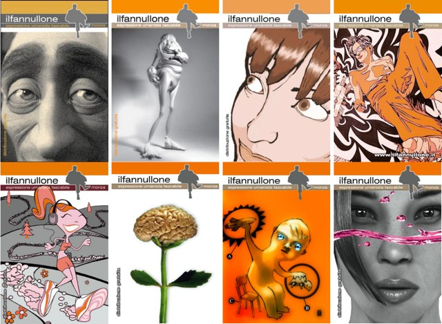

# Il Fannullone

Il sito della mitica rivista tascabile umanista **Il Fannullone**.

Tutti i mitici 12 numeri usciti tra dicembre 2004 e ottobre 2006.

<https://stefanocecere.github.io/ilfannullone.it>

Per contatti e commenti scrivete a [Stefano Cecere](https://github.com/StefanoCecere) oppure aprite una issue [qui](https://github.com/StefanoCecere/ilfannullone.it/)

